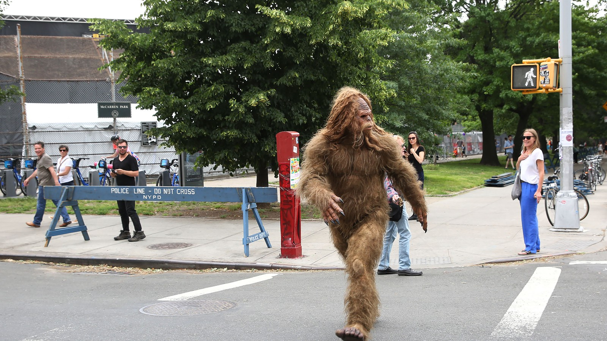

# Case Study: Using NLP on Bigfoot, UFO Sightings
&nbsp;

&nbsp;

## Objective: Use NLP and Naive Bayes to create a model that will predict whether a given text describes a sighting of a UFO or Bigfoot. 
&nbsp;

## Steps 
1. Parsing the bigfoot and ufo data using BeautifulSoup
2. 
